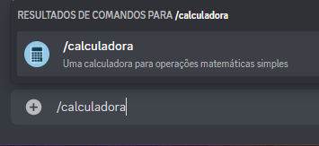
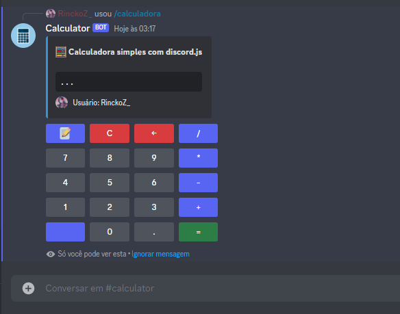
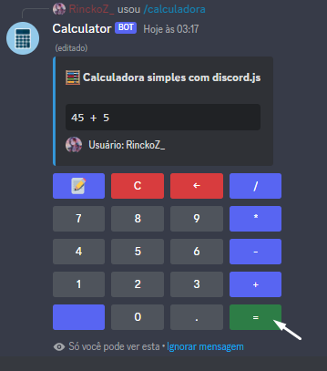
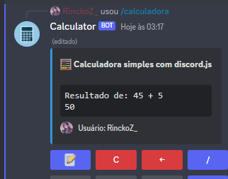
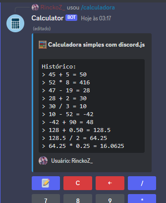
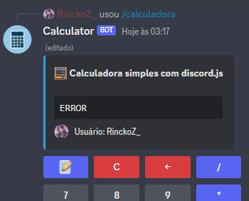

# CALCULADORA NO DISCORD
🤖ESTE É UM BOT DO DISCORD FEITO COM DISCORDJS. ESTE BOT IMPLEMENTA UMA CALCULADORA INTERATIVA NO DISCORD USANDO BOTÕES PARA NÚMEROS, OPERADORES E FUNÇÕES ESPECIAIS.

 <br>
 <br>
 <br>
 <br>
 <br>
 <br>

## DESCRIÇÃO:
Este bot implementa uma calculadora interativa no Discord usando botões para números, operadores e funções especiais.

## FUNCIONALIDADES:
- **Classes Enumeradas** (`CalculatorStatus` e `CalculatorSlot`):
  - Define o estado atual da calculadora e o tipo de slot de operação atual.

- **Classe `Calculator`**:
  - Mantém o estado atual da calculadora, incluindo a operação atual, o resultado, o histórico de operações e os mapeamentos de operadores.

- **Comando `calculadora`**:
  - Define o comando Discord para iniciar a calculadora.
  - Cria uma mensagem embed com a interface da calculadora contendo botões para números, operadores e funções especiais.
  - Gerencia a interação do usuário com os botões, atualizando dinamicamente a interface conforme as operações são inseridas e calculadas.

## EXECUTANDO O PROJETO:
1. **Editar o código:**
   - Certifique-se de substituir `seu_token_aqui` pelas informações corretas das suas credenciais em `CODIGO/src/.env`.

2. **Instalando as Depêndencias:**
   - Para instalar as dependências listadas no arquivo "package.json", você pode usar o comando `npm install` no terminal. Certifique-se de estar no diretório do seu projeto onde o arquivo "package.json" está localizado (`CODIGO`). O npm irá ler o arquivo "package.json" e instalar todas as dependências listadas nele. 

   ```bash
   npm install
   ```

3. **Inicie o Bot:**
   - Execute o bot do Telegram iniciando-o com o seguinte comando:
    ```bash
    npm start
    ```

4. **Como Usar no Discord**:
   - No servidor Discord onde o bot está presente, use o comando associado a esta calculadora (no exemplo, provavelmente `/calculadora`).
   - O bot irá enviar uma mensagem com uma interface de calculadora contendo botões para números de 0 a 9, operadores (+, -, *, /), botões de limpar, retroceder, histórico e resultado.

5. **Operação da Calculadora**:
   - **Inserir Números**: Clique nos botões numéricos para inserir os números na operação atual.
   - **Inserir Ponto Decimal**: Use o botão de ponto (`.`) para adicionar decimais aos números.
   - **Inserir Operadores**: Clique nos botões de operadores para adicionar operações como adição, subtração, multiplicação e divisão.
   - **Limpar e Retroceder**: Use os botões de limpar (`C`) para limpar a operação atual e de retroceder (`←`) para apagar o último caractere inserido.
   - **Histórico**: Visualize o histórico das operações clicando no botão com emoji de bloco de notas (`📝`). Se o texto do histórico for muito longo, ele será enviado como arquivo de texto.
   - **Obter Resultado**: Clique no botão de igual (`=`) para calcular o resultado da operação inserida.

6. **Tratamento de Erros**:
   - A calculadora inclui tratamento de erros para operações inválidas, como divisões por zero ou operações não reconhecidas.
  
## NÃO SABE?
- Entendemos que para manipular arquivos em muitas linguagens e tecnologias relacionadas, é necessário possuir conhecimento nessas áreas. Para auxiliar nesse aprendizado, oferecemos cursos gratuitos disponíveis:
* [CURSO DE DISCORDJS](https://github.com/VILHALVA/CURSO-DE-DISCORDJS)
* [CURSO DE TYPESCRIPT](https://github.com/VILHALVA/CURSO-DE-TYPESCRIPT)
* [CURSO DE NODEJS](https://github.com/VILHALVA/CURSO-DE-NODEJS)
* [CONFIRA MAIS CURSOS](https://github.com/VILHALVA?tab=repositories&q=+topic:CURSO)

## CREDITOS:
- [PROJETO CRIADO PELO "rinckodev"](https://github.com/rinckodev/CalculatorBot)
- [PROJETO FEITO PELO VILHALVA](https://github.com/VILHALVA)

